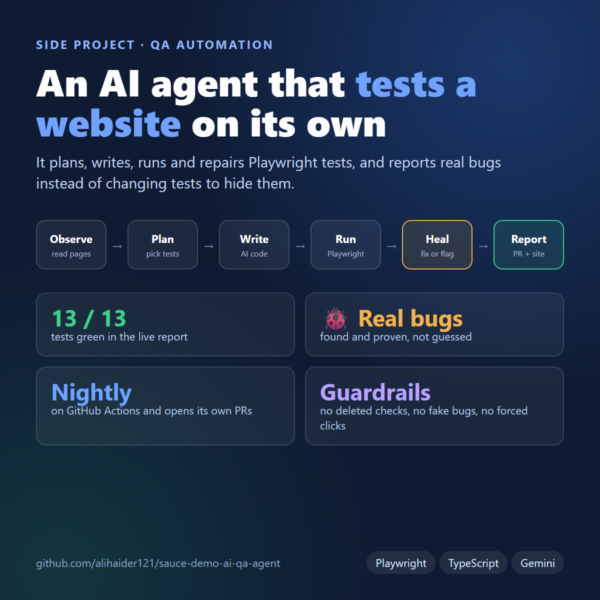
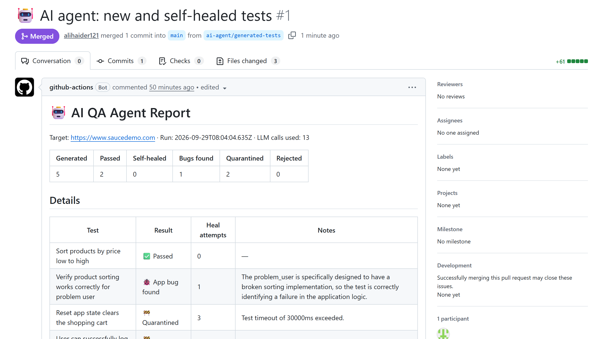
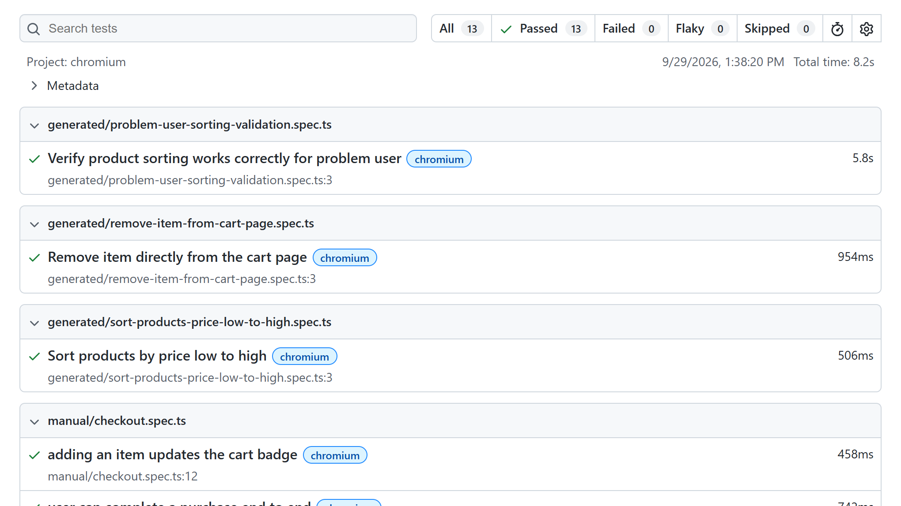
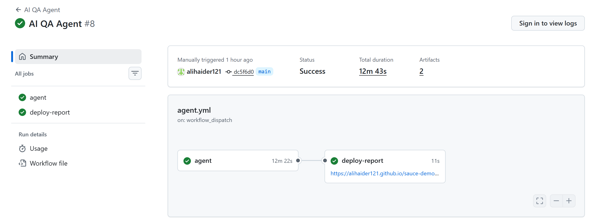

# 🤖 Sauce Demo AI QA Agent



An **autonomous AI testing agent** that writes, runs, self-heals and reports Playwright tests for
[saucedemo.com](https://www.saucedemo.com), with **no human in the loop**.
It runs every night in GitHub Actions and uses **free** AI: GitHub Models by default (no API key needed),
or any OpenAI-compatible provider such as Google Gemini.


📊 **Live report:** https://alihaider121.github.io/sauce-demo-ai-qa-agent/

## What it produces

| The agent opens its own pull requests | Every run publishes a test report |
|---|---|
|  |  |



## How the agent thinks

```
 ┌──────────┐   ┌────────┐   ┌────────┐   ┌───────┐   ┌──────────────┐   ┌──────────┐
 │ OBSERVE  │──▶│  PLAN  │──▶│ WRITE  │──▶│  RUN  │──▶│ REFLECT/HEAL │──▶│  REPORT  │
 │ snapshot │   │ decide │   │ code a │   │ play- │   │ test bug? fix│   │ summary +│
 │ the pages│   │ tests  │   │ .spec  │   │ wright│   │ app bug? flag│   │ HTML/PR  │
 └──────────┘   └────────┘   └────────┘   └───────┘   └──────┬───────┘   └──────────┘
                                              ▲              │ fixed (max 3 tries)
                                              └──────────────┘
```

| Step | File | What happens |
|---|---|---|
| Observe | `agent/observe.ts` | Opens each page and captures its accessibility tree and `data-test` ids |
| Plan | `agent/run.ts` + `prompts.ts` | The model proposes new test scenarios as JSON |
| Write | `agent/run.ts` | The model writes one `.spec.ts` per scenario into `tests/generated/`. Tests merged from earlier runs are kept: the planner is told about them to avoid duplicates, and new files never overwrite them, so the suite grows run by run |
| Run | `agent/run.ts` | Playwright runs it, and the agent reads the JSON result |
| Reflect / Heal | `agent/run.ts` | On failure, the model decides whether it's a **test bug** (fix it and rerun) or an **app bug** (flag it with `test.fail()`) |
| Report | `agent/report.ts` | Markdown summary, GitHub job summary, HTML report on Pages, and a PR with the new tests |

## 🛡️ Guardrails (`agent/guardrails.ts`)
An autonomous agent needs hard limits:
- It may only write inside `tests/generated/`.
- Generated code must use Playwright, contain assertions, and stay on saucedemo.com. `test.skip`, network mocking, file access, `{ force: true }` and fixed sleeps (`waitForTimeout`) are not allowed.
- **No cheating:** a "fix" with fewer `expect()` calls than the original is rejected.
- There are budgets for scenarios per run, heal attempts per test (3), and total LLM calls, to stay inside the free tier.
- Tests it can't heal are **quarantined** rather than left broken.
- **App bugs must be proven:** an "app bug" verdict is only accepted for users with deliberate defects
  (`problem_user`, `error_user`, `visual_user`, `performance_glitch_user`), and only if the test really
  fails on the live site when rerun with `test.fail()`.
- If the AI is unavailable for one scenario, that scenario is quarantined and the run carries on.

The `problem_user` account on Sauce Demo has deliberate bugs. The agent is told to assert the *correct*
behaviour, so it should **report those bugs** instead of "fixing" the tests to accept them.

## Run it on your laptop
```bash
npm install
npx playwright install chromium
npm run test:manual          # the 10 hand-written tests
                             # (download blocked? set PW_CHANNEL=msedge in .env to use Edge)
cp .env.example .env         # add a GitHub token with "Models: read" (or a Gemini key, see below)
npm run agent                # 🤖 let the agent loose
npm run report               # open the HTML report
```

### Choosing the AI provider
| Setting (`.env` or GitHub Actions) | GitHub Models (default) | Google Gemini (free tier) |
|---|---|---|
| `GITHUB_TOKEN` | token with **Models: read** | — |
| `LLM_BASE_URL` | *(empty)* | `https://generativelanguage.googleapis.com/v1beta/openai/` |
| `LLM_API_KEY` | *(empty)* | key from https://aistudio.google.com/apikey |
| `MODEL` | `openai/gpt-4o-mini` | `gemini-3.7-flash,gemini-3.6-flash,gemini-3.8-flash` |

`MODEL` can list several models separated by commas. When one is busy or rate limited, the agent tries the next one.
Gemini's free tier allows about **20 requests per model per day**, and a 5-scenario run needs up to ~21,
so listing 3 or more models is recommended.

## Run it in GitHub (fully autonomous)
1. Push this repo to GitHub.
2. **Settings → Pages → Source: GitHub Actions**
3. **Settings → Actions → General → Workflow permissions:** tick *"Allow GitHub Actions to create and approve pull requests"*.
4. *(Optional, to use Gemini)* **Settings → Secrets and variables → Actions:** add secret `LLM_API_KEY`, and variables `LLM_BASE_URL` and `MODEL`.
5. **Actions → AI QA Agent → Run workflow** (after that it runs nightly on its own).

## Tech
Playwright · TypeScript · GitHub Actions · GitHub Models / Gemini (OpenAI-compatible API) · Page Object Model
